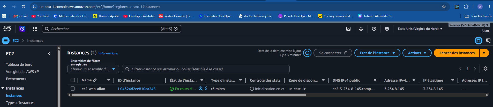
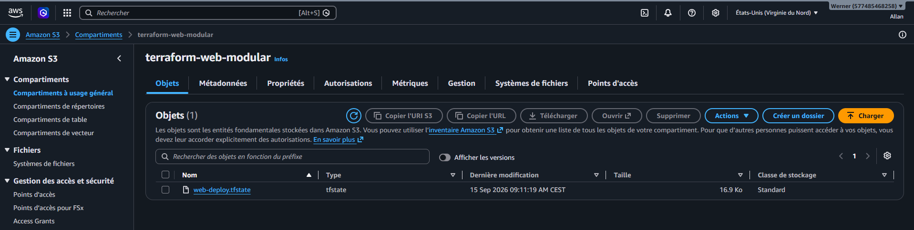

# Terraform Modular Web Deploy on AWS

Infrastructure-as-Code project that provisions a web server on AWS using a **modular Terraform** design and a **remote S3 backend** with state locking.

## What this project does

Running `terraform apply` in `app/` provisions, on AWS:

- **EC2 instance** (Ubuntu 22.04, latest AMI looked up dynamically via `data "aws_ami"`) sized with a configurable instance type.
- **Nginx web server** installed and started automatically on boot through a `remote-exec` provisioner over SSH.
- **Security group** opening HTTP (80), HTTPS (443) and SSH (22).
- **Elastic IP** attached to the instance, with a `local-exec` provisioner that writes the public IP, instance ID and availability zone to a local file after apply.
- **EBS volume**, created and attached to the instance as an extra disk.
- **Remote state** stored in an S3 bucket (`terraform-web-modular`), with native S3 state locking (`use_lockfile`) instead of a separate DynamoDB table.

## Repository structure

```
.
├── app/                      # Root module (environment entry point)
│   └── main.tf                 # Provider, backend and module composition
└── modules/
    └── ec2_module/            # Reusable EC2 module
        ├── main.tf              # AMI lookup, instance, security group, EIP, EBS
        └── variables.tf         # Module input variables
```

The **root module** (`app/`) wires the provider and remote backend, then calls the **`ec2_module`**, which encapsulates all the AWS resources. This separation keeps the deployable environment decoupled from the reusable infrastructure logic — the module can be reused by other environments/root modules without duplicating resource definitions.

## Module inputs (`ec2_module`)

| Variable          | Type     | Description                  |
|--------------------|----------|-------------------------------|
| `instancetype`     | `string` | EC2 instance type             |
| `aws_common_tags`  | `map`    | Tags applied to the instance  |
| `ebs_volume_size`  | `number` | Size (GiB) of the attached EBS volume |

## Prerequisites

- [Terraform](https://developer.hashicorp.com/terraform/downloads) `1.16.2`
- An AWS account and IAM credentials with permissions for EC2, S3, and EBS
- An existing S3 bucket for the remote backend
- An existing EC2 key pair (referenced as `devops-allan` in this example) and its private key
- AWS credentials configured as a named profile (`shared_credentials_files` + `profile`), kept outside version control

Secrets, private keys, `.tfstate` files and Terraform cache directories are excluded from version control via `.gitignore`.

## Usage

```bash
cd app
terraform init
terraform plan
terraform apply
```

On completion, the public IP, instance ID and availability zone are appended to `infos_ec2.txt`, and Nginx is reachable over HTTP at the instance's public/elastic IP.

## Screenshots

**EC2 instance running in the AWS Console**



**Terraform state stored remotely in S3**



## Skills demonstrated

- Modular Terraform design (root module + reusable child module)
- Remote state management with S3 backend and state locking
- AWS provisioning: EC2, Security Groups, Elastic IP, EBS
- Server bootstrapping via provisioners (`remote-exec`, `local-exec`)
- Secrets and sensitive files kept out of version control
